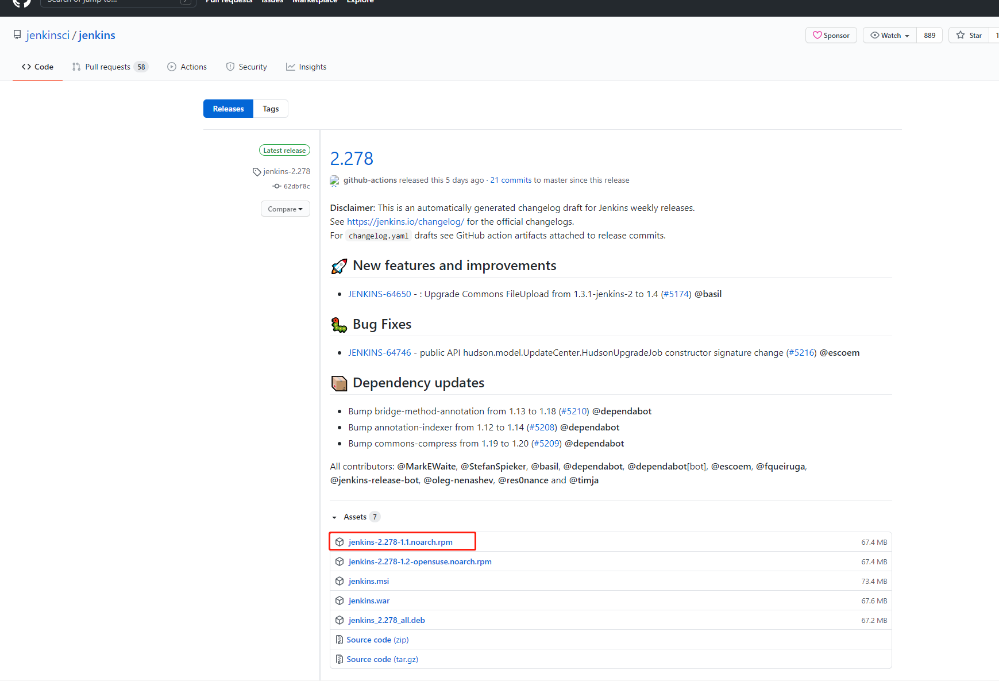
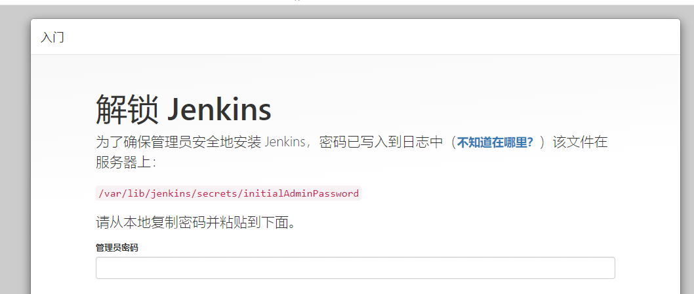
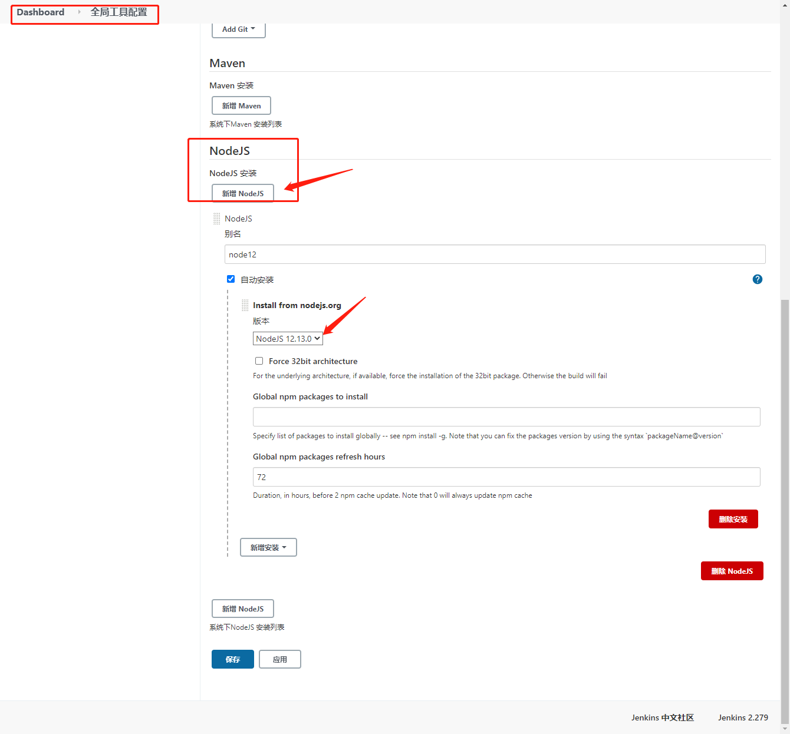

# Jenkins

> 自动化集成/部署(CI & CD)Jenkins+GitHub+vitepress 提交触发 webhook 自动部署 blog/vue 项目 参考地址:[https://www.jianshu.com/p/2fc8340de073](https://www.jianshu.com/p/2fc8340de073)

## 前置工作

配置:linux 服务器一台(建议用阿里云/腾讯云) 安装方式:linux 使用 rpm 安装

## 1.安装 jenkins

### 1.1 安装 java 环境

```
yum -y list java*          查看所有可用版本
yum install -y java-1.8.0-openjdk-devel.x86_64       选择一个版本安装
java -version        查看安装的java版本
```

### 1.2 下载 jenkins 的 rpm 安装包

最快的方式是去[github](https://github.com/jenkinsci/jenkins/releases)上下载，然后用 xshell+xftp 传到 linux 服务器上&#x20;



我的 rpm 包路径(其实放哪无所谓) /jenkins/jenkins-2.278-1.1.noarch.rpm

```
cd /jenkins   进入到包所在的文件夹
rpm -ivh jenkins-2.278-1.1.noarch.rpm     解压jenkins
```

### 1.3 修改下端口号和权限

默认是(8080)，有必要修改一下配置文件的端口号,。我比较喜欢用 xftp 修改。 文件路径/etc/sysconfig/jenkins  在第 56 行附近修改自己的端口号


```
JENKINS_PORT="8888"
```

同时建议将权限放开为 root，后面打包后，移动文件夹需要权限 在第 29 行附近

```
JENKINS_USER="root"
```

### 1.4 替换一下镜像源，不然打开的很慢

打开页。你可能会发现页面很慢，很卡。需要替换一下镜像源 找到 hudson.model.UpdateCenter.xml 文件，用指令找 find . -name "SaleContractFromDC.jsp" 先回到根目录 cd / find . -name "hudson.model.UpdateCenter.xml" 发现路径在 /var/lib/jenkins/hudson.model.UpdateCenter.xml 将[https://updates.jenkins.io/update-center.json](https://updates.jenkins.io/update-center.json) 修改成[http://mirror.xmission.com/jenkins/updates/update-center.json](http://mirror.xmission.com/jenkins/updates/update-center.json)

### 1.4 启动/关闭/重启 命令

```
service jenkins start
service jenkins stop
service jenkins restart
```

### 1.5 打开页面，找到默认密码进入。

需要找到对应的密码。然后登录就行。 cat /var/lib/jenkins/secrets/initialAdminPassword&#x20;



### 1.6 相关插件

相关插件安装:可能会有安装一些推荐配置。不安装后面也可以自己安装 Mange Jenkins(管理 Jenkins)>Manage Plugins(管理插件)>Available 下搜索安装

1. Build Timeout
2. Folders Plugin
3. Git (必备)
4. OWASP Markup Formatter
5. Timestamper
6. Credentials Binding
7. Github (拉取 github 地址)
8. Nodejs (执行打包脚本) 同时也前往 全局工具配置-》添加对应的 Node 配置
9. Locale (应该是自带了)
10. Localization: Chinese (Simplified) (与 9 配合可进行汉化)
11. 可能会遇到无法识别 github 地址的情况，前往 linux 中将 git 更新到最新，重启一下

```
yum -y install git
```

### 1.7 对 jenkins 中做点配置

做一点前置配置，然后才能创建项目

将[1.6相关插件检查](https://app.gitbook.com/@tangjian1891/s/tangjia/\~/drafts/-MiAkszaVzg9AgbZe2A4/fu-wu-qi-xiang-guan/jenkins#16-xiang-guan-cha-jian)上面的插件检查一下

将 node 配置上 系统管理->全局工具配置->NodeJs 添加一个 &#x20;



配置下 github 提交的钩子 hook。配置方法。前往自己的 github->对应仓库->settings->Webhooks 添加一个。地址是约定的格式。 假设你 jenkins 为 192.168.0.1:8888 那么配置的地址为 [http://192.168.0.1:8888/github-webhook/](http://192.168.0.1:8888/github-webhook/) 就可以了。


执行的脚本。流程为 装依赖->打包->到工作区找到打包好的文件夹->复制到对应 nginx 下

```
npm i   每次安装依赖

npm run build  执行打包

mv /var/lib/jenkins/workspace/nice-blog/docs/.vitepress/dist  /var/lib/jenkins/workspace/nice-blog/docs/.vitepress/nice-blog     我这里修改了一下打包成功后的文件名称,将dist改为了nice-blog(看个人需求)

cp -r /var/lib/jenkins/workspace/nice-blog/docs/.vitepress/nice-blog  /marlinos/nginx/1.18.0/html 将打包好的资源复制到nginx下面 ，然后即可访问
```

配置全图

打包的目录所在位置 /var/lib/jenkins/workspace/nice-blog

需要将文件复制一份到 nginx 中 cp -r /var/lib/jenkins/workspace/nice-blog/docs/.vitepress/dist /marlinos/nginx/1.18.0/html/nice-blog


完结！其余碰到的问题，自行百度吧,都是可以解决的。 1. 可能出现权限不足，无法移动的文件的问题 2. 可能出现隐藏文件夹找不到的问题
